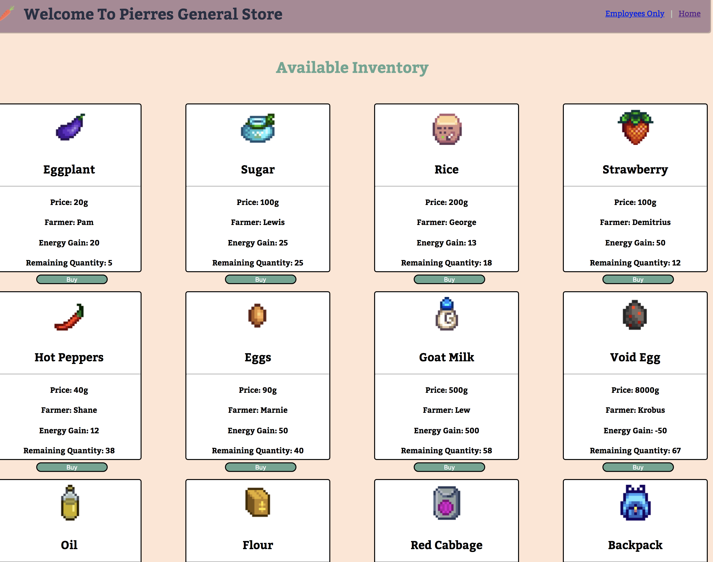
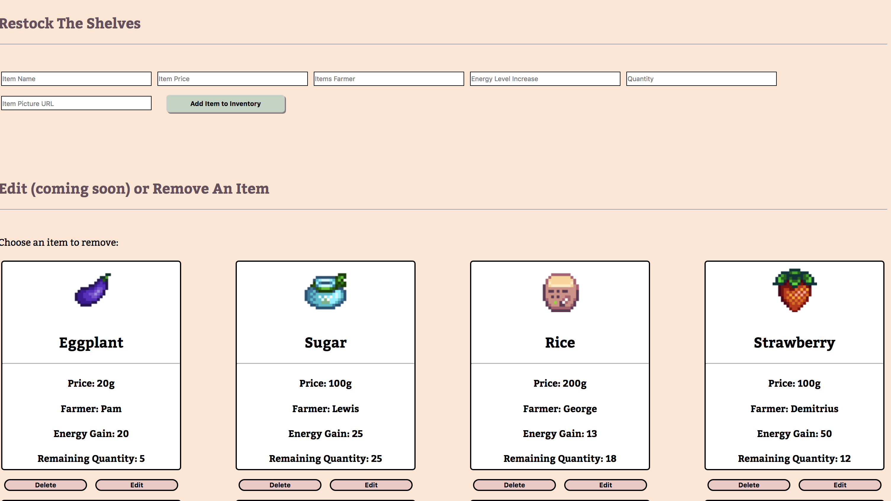

## Pierre's General Store in React
##### Lew Davidson

* Description:

>A re-creation of an existing Angular App using React to build out the component tree and styling. This is intended to be a dynamic App after next Friday, with functionality for adding and editing inventory and the ability to "sell" or decrement stock levels.

* Previews:

* Differences in development process between Angular and React:

Right off the bat there are a few that come to mind. React needs more separate components to achieve the styling and structure that you want in the view. Angular has little pieces that fit together whereas React seems to have different pieces that need to overlap and sit on top of each other. The planning process is really vital in React due to the need for everything to hold hands and have a specific purpose. CSS is also quite a bit different in React, much more collaboration between parent and child components is needed for the CSS to function correctly.   

 * Component Structure:

 [Original Whiteboard drawing](https://imgur.com/a/kqzS4)

 [Week Two Whiteboard Drawing](https://imgur.com/a/kmplJ)

### To-Do:

[x] Potentially re-factor component tree before lifting state

[x] Lift state to add the ability to add, display, and manage new inventory

[x] Add functionality to pass refs into APP to display new items

 Go Further:

 [x] Add functionality to delete items from admin

 [ ] Add functionality to edit items from admin

 [x] Add functionality to 'sell' an item and decrease its inventory

 [x] Add unique IDs to items, instead of looking up by index
